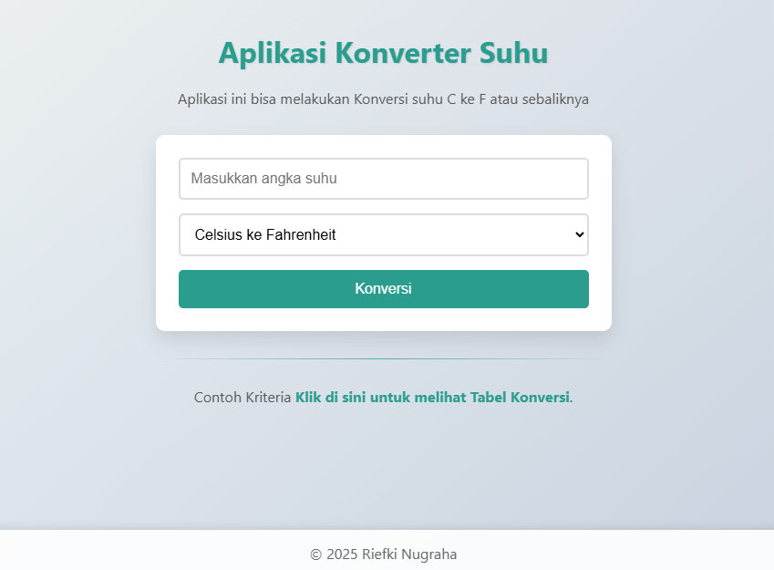

# Aplikasi Web Konversi Suhu dengan Flask

[](https://www.python.org/)
[](https://flask.palletsprojects.com/)

Aplikasi web sederhana ini dibuat menggunakan framework Flask (Python) untuk mengkonversi suhu dari Celsius (°C) ke Fahrenheit (°F). Proyek ini dikembangkan sebagai bagian dari tugas mata kuliah Algoritma dan Pemrograman, dengan fokus pada implementasi konsep dasar pemrograman: Urutan (Sequence), Seleksi (Selection), Iterasi (Iteration), dan Fungsional (Functional).

## Fitur Utama

* **Konversi Suhu:** Memungkinkan pengguna memasukkan suhu dalam Celsius dan mendapatkan hasilnya dalam Fahrenheit.
* **Implementasi Konsep Algoritma:**
    * **Sequence:** Alur eksekusi yang jelas saat menerima input, memproses, dan menampilkan output.
    * **Selection:** Penggunaan struktur `if` untuk menentukan rumus konversi dan validasi.
    * **Iteration:** Menampilkan tabel konversi suhu dari 0°C hingga 20°C menggunakan `for loop`.
    * **Functional:** Penggunaan fungsi `convert_temperature` untuk memisahkan logika konversi.
* **Antarmuka Sederhana:** Tampilan web yang bersih dan mudah digunakan.
* **Contoh Iterasi:** Halaman terpisah yang mendemonstrasikan penggunaan perulangan secara visual.

## Screenshots

Berikut adalah tampilan dari aplikasi web konversi suhu:

### Halaman Utama
[](screenshot/main.png)
*Halaman input untuk mengkonversi suhu.*

### Hasil Konversi
[](screenshot/hasil.png)
*Hasil konversi suhu dari Celsius ke Fahrenheit.*

### Halaman Tabel Konversi (Contoh Iterasi)
[](screenshot/tabel.png)
*Halaman yang menampilkan tabel konversi menggunakan iterasi.*

## Prasyarat

Pastikan Anda telah menginstal Python 3 dan pip di sistem Anda.

## Instalasi dan Cara Menjalankan

1.  **Klon repositori ini:**
    ```bash
    git clone https://github.com/riefki-123/web-app-konversi-suhu
    ```

2.  **Buat dan aktifkan virtual environment (disarankan):**
    ```bash
    # Untuk macOS dan Linux
    python3 -m venv env
    source env/bin/activate
    
    # Untuk Windows
    py -m venv env
    env\Scripts\activate
    ```

3.  **Install dependensi Pada Requirements:**
    ```bash
    pip install -r requirements.txt
    ```

4.  **Jalankan aplikasi:**
    ```bash
    python app.py
    ```

5.  Buka browser web Anda dan kunjungi alamat `http://127.0.0.1:5000`.

## Struktur Kode

* `app.py`: Berisi logika utama aplikasi web menggunakan Flask.
* `templates/`: Folder yang berisi file-file HTML untuk tampilan antarmuka.
    * `index.html`: Halaman utama konverter suhu.
    * `tabel.html`: Halaman yang menampilkan tabel konversi.
* `screenshots/`: Folder untuk menyimpan gambar tampilan aplikasi.

## 🤝 Kontribusi

Kami sangat terbuka untuk *Pull Request*. Jika Anda ingin melakukan perubahan besar, silakan buka *issue* terlebih dahulu untuk mendiskusikan apa yang ingin Anda ubah.

---

<div align="center">
  Dibuat dengan ❤️ oleh Riefki Nugraha
</div>